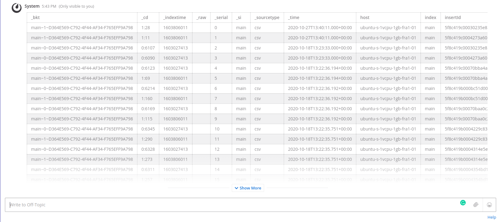

# Splunk Plugin 
**Maintainer:** [@dbejanishvili](https://github.com/dbejanishvili)
**Co-Maintainers:** [@bakurits](https://github.com/bakurits) [@Gvantsats](https://github.com/Gvantsats)

Splunk integration for mattermost. Enabling users to get logs and alerts from splunk server.
To learn more about Mattermost plugins, see [Mattermost plugin documentation](https://developers.mattermost.com/extend/plugins/).

## Table of Contents
- [License](#license)
- [System Admin Instructions](#for-mattermost-system-admins)
    - [Plugin Setup](#plugin-setup)
- [User Instructions](#for-users)
    - [Slash Commands](#slash-commands)
- [Developer/Contributor Instructions](#for-developers-and-contributors)
    - [Setting Up Environment](#setting-up-environment)
    - [Building And Deployment](#building-and-deployment)

## **License**

This repository is licensed under the [Apache 2.0 License](https://github.com/bakurits/mattermost-plugin-anonymous/blob/master/LICENSE).


## **For Mattermost System Admins**
### Plugin Setup
You can install the plugin from mattermost plugin marketplace, or follow the instructions given in [Building And Deployment](#building-and-deployment) section

## **For Users**
### Slash Commands
* __Authenticate user__ - use `/splunk auth --login [server base url] [username/token]` you must be logged into the system before you use any slash commands regarding logging. To authenticate the user you can use this slash command with two required parameters Splunk server base URL, Splunk username, or token.
  If you already logged in to a plugin with a token, the second and next logins can be done with username too. After successful authentication this message is shown:

    

* __Get list of all logs from server__ - use `/splunk log --list` this slash command returns list of all available logs from splunk server.

    

* __Get specific log from server__ - use `/splunk log [logname]` to get specific log from server you can use this slash command. 

    

* __Subscribe to alerts__ - use `/splunk alert --subscribe` to subsribe to alerts you must first use this slash command and add link for splunk

    

    after receiving alert splunk bot posts in the channel that new alert is received.

    


* __Help!__ - use `/splunk help` command, to see how to properly use slash commands


## **For Developers And Contributors**
### Setting Up Environment
Fork the repository to your own account and then clone it to a directory outside of `$GOPATH` matching your plugin name:
```
git clone https://github.com/owner/mattermost-plugin-splunk
```

Note that this project uses [Go modules](https://github.com/golang/go/wiki/Modules). Be sure to locate the project outside of `$GOPATH`, or allow the use of Go modules within your `$GOPATH` with an `export GO111MODULE=on`.

### Building And Deployment
To build your plugin use `make`

Use `make check-style` to check the style.

Use `make debug-dist` and `make debug-deploy` in place of `make dist` and `make deploy` to configure webpack to generate unminified Javascript.

`make` will produce a single plugin file (with support for multiple architectures) for upload to your Mattermost server:

```
dist/com.example.my-plugin.tar.gz
```

Alternatively you can deploy a plugin automatically to your server, but it requires login credentials:
```
export MM_SERVICESETTINGS_SITEURL=http://localhost:8065
export MM_ADMIN_USERNAME=admin
export MM_ADMIN_PASSWORD=password
make deploy
```

or configuration of a [personal access token](https://docs.mattermost.com/developer/personal-access-tokens.html):
```
export MM_SERVICESETTINGS_SITEURL=http://localhost:8065
export MM_ADMIN_TOKEN=j44acwd8obn78cdcx7koid4jkr
make deploy
```

In production, deploy and upload your plugin via the [System Console](https://about.mattermost.com/default-plugin-uploads).


 
